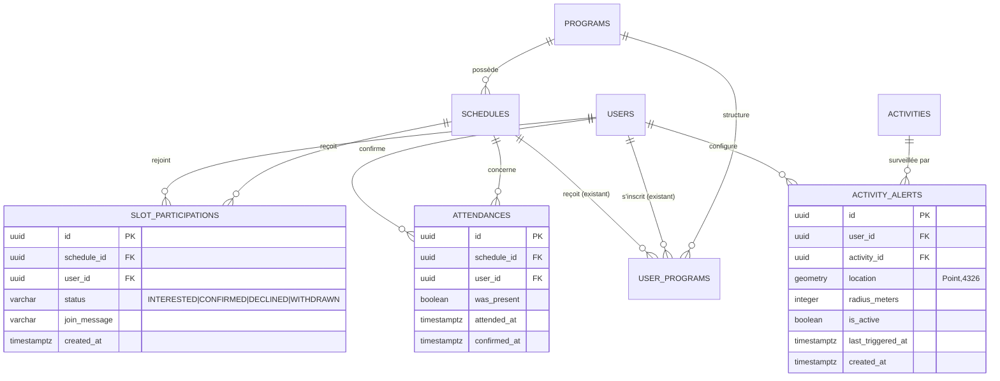

# meetDo — Évolution backend : ce qui a changé pour le frontend

> Destiné à l'instance Claude Code travaillant sur le frontend. Décrit l'implémentation
> backend de l'évolution meetDo (créneaux ouverts, boucle de confirmation de présence,
> statistiques de pratique, alertes par activité), la nouvelle structure de base de
> données et les relations entre tables. Basé sur la spec `docs/specs/meetdo-evolution-backend-spec.md`,
> avec les adaptations nécessaires à l'architecture existante (détaillées ci-dessous).

Namespace inchangé : `org.program.pair`. Aucun renommage de package.

**Principe produit non négociable, déjà appliqué côté backend** : aucun endpoint ne
classe les utilisateurs entre eux. Les statistiques de pratique sont un miroir
personnel (nombre de partenaires différents, régularité), jamais un classement. Ne
construisez aucun écran de type "top utilisateurs" à partir de ces données.

---

## 1. Décision d'architecture à connaître avant tout

Deux mécanismes de "participation" coexistent désormais sur une même `Schedule`
(un créneau) :

| Mécanisme | Endpoint | Table | Usage prévu |
|---|---|---|---|
| **Inscription à un programme structuré** (existant) | `POST /api/programs/{programId}/join` | `user_programs` | Rejoindre un programme multi-semaines, avec suivi de progression (activités complétées, %). |
| **RSVP léger sur un créneau** (nouveau) | `POST /api/slots/{scheduleId}/join` | `slot_participations` | "Je viens à cette séance précise", sans engagement de suivi. C'est le flux central de meetDo. |

**Ces deux mécanismes partagent la même capacité.** `Schedule.maxParticipants` est
vérifié sur la somme des inscriptions actives des deux tables. `Schedule.participantCount`
(champ dénormalisé exposé dans les DTOs) reflète ce total combiné, pas seulement l'un
des deux mécanismes. Un créneau peut donc passer à `FULL` à cause d'inscriptions
`user_programs`, de RSVP `slot_participations`, ou d'un mélange des deux.

Pour l'UI : n'affichez jamais "places restantes" en ne comptant qu'une seule des deux
sources — utilisez toujours `participantCount`/`maxParticipants` renvoyés par l'API.

---

## 2. Le créneau (`Schedule`) devient un objet ouvert et rejoignable

### Champs ajoutés à l'entité `Schedule` (table `schedules`)

| Champ JSON (DTO) | Type | Défaut | Description |
|---|---|---|---|
| `isOpenToPartners` | boolean | `true` | Si `false`, le créneau n'apparaît jamais dans le feed `/api/slots/feed` et ne peut pas être rejoint via `/api/slots`. |
| `status` | string enum | `"OPEN"` | `OPEN` \| `FULL` \| `CANCELLED` \| `PAST`. Voir cycle de vie ci-dessous. |
| `participantCount` | integer | `0` | Total combiné (voir section 1). Recalculé à chaque join/leave. |
| `welcomeNote` | string (300 max) | `null` | Message libre affiché aux personnes intéressées ("Débutants bienvenus", etc.). Sanitized côté serveur. |

Ces champs sont exposés dans `ScheduleDto` (renvoyé par les endpoints existants
`POST/PUT /api/programs/{programId}/schedules`) **et** dans `SlotFeedItemDto` (nouveaux
endpoints `/api/slots/*`, voir section 3).

`CreateScheduleRequest` et `UpdateScheduleRequest` (utilisés par l'hôte pour créer/éditer
un créneau via `ProgramController`) acceptent désormais optionnellement `isOpenToPartners`
et `welcomeNote`. Aucun changement de endpoint : la création reste sous
`/api/programs/{programId}/schedules`, il n'y a pas de endpoint de création dédié aux slots.

### Cycle de vie du statut

```
OPEN --(participantCount atteint maxParticipants)--> FULL
FULL --(un participant part)--------------------------> OPEN
OPEN/FULL --(hôte annule, des participants existent)--> CANCELLED  (notification SLOT_CANCELLED à tous)
OPEN/FULL --(job horaire, créneau terminé depuis >2h)-> PAST
```

**Changement de comportement sur `DELETE /api/programs/{programId}/schedules/{scheduleId}`** :
si le créneau a des participants (slot ou programme), il n'est **plus supprimé** —
il passe en `CANCELLED` et chaque participant reçoit une notification `SLOT_CANCELLED`.
S'il n'a aucun participant, la suppression reste définitive comme avant. **Le frontend
doit donc gérer l'affichage d'un créneau `CANCELLED`** (ne plus le proposer au join,
l'afficher barré/grisé dans "mes créneaux") plutôt que de supposer qu'un créneau
supprimé disparaît toujours de l'API.

---

## 3. Nouveaux endpoints — Slots (`/api/slots`)

Toutes les routes nécessitent l'authentification standard (`@AuthenticationPrincipal`).

### `GET /api/slots/feed`
Feed "autour de moi" — coeur du produit. Query params :

| Param | Type | Requis | Contrainte |
|---|---|---|---|
| `lat` | double | oui | -90..90 |
| `lng` | double | oui | -180..180 |
| `radiusMeters` | int | oui | 500..50000 |
| `activityId` | UUID | non | filtre optionnel |
| `categoryId` | UUID | non | filtre optionnel |
| `from` | ISO instant | non | défaut = maintenant |
| `to` | ISO instant | non | défaut = maintenant + 7 jours |

Ne retourne **jamais** : un créneau dont l'hôte est inactif, dont l'activité est masquée
de la carte (`visibleOnMap=false`), dont le programme est privé/non actif, ni les
créneaux de l'utilisateur courant lui-même. Trié par date puis distance.

Réponse : `SlotFeedItemDto[]`

```jsonc
{
  "scheduleId": "uuid",
  "programId": "uuid",
  "programTitle": "Yoga du matin",
  "activityName": "Yoga",
  "categoryColorRamp": "green", // Category.colorRamp
  "level": "BEGINNER",          // ActivityLevel | null
  "format": "GROUP",            // ActivityFormat | null
  "host": { /* UserPublicDto */ },
  "placeName": "Studio Zen",
  "displayAddress": "12 rue de la Paix", // null si lieu privé et non partagé
  "lat": 48.85,                          // null si lieu privé et non partagé
  "lng": 2.35,
  "distanceMeters": 850.4,               // null hors contexte géolocalisé (get/mine/participants)
  "startsAt": "2026-08-01T07:00:00Z",
  "endsAt": "2026-08-01T08:00:00Z",
  "maxParticipants": 8,
  "participantCount": 3,                 // combiné user_programs + slot_participations
  "isOpenToPartners": true,
  "welcomeNote": "Débutants bienvenus",
  "myParticipationStatus": null          // "CONFIRMED" | "WITHDRAWN" | null si je n'ai pas rejoint
}
```

Règle d'adresse : `lat`/`lng`/`displayAddress` ne sont renvoyés que si le lieu est
`PUBLIC`, ou `PRIVATE` avec `showExactAddress=true`, ou si le viewer a déjà une
participation `CONFIRMED` sur ce créneau. Sinon tout est `null` (seul `placeName`,
générique, reste visible).

### `GET /api/slots/{scheduleId}`
Détail d'un créneau (mêmes règles de visibilité d'adresse, `distanceMeters=null`).

### `POST /api/slots/{scheduleId}/join`
Body optionnel : `{ "joinMessage": "Je débute, ça vous va ?" }` (max 300 car., sanitized).
→ `201 Created`, `SlotFeedItemDto`.

Effets de bord :
- Ouvre automatiquement une conversation avec l'hôte (contextualisée par l'activité),
  **sauf** si l'hôte a `receiveMessages=false` (aucune erreur dans ce cas, juste pas
  de conversation créée).
- Notifie l'hôte (`SLOT_JOINED`).
- Rejette avec `400` si : créneau déjà passé, non ouvert aux partenaires, plus `OPEN`/complet,
  hôte qui tente de rejoindre son propre créneau.
- Rejette avec `422` si déjà rejoint (doublon).

### `DELETE /api/slots/{scheduleId}/join`
Se désinscrire (statut → `WITHDRAWN`). → `204 No Content`.

### `GET /api/slots/mine?upcoming=true|false` (défaut `true`)
Créneaux que je **crée** (hébergés, ouverts aux partenaires) OU que j'ai **rejoints**
(participation `INTERESTED`/`CONFIRMED`). → `SlotFeedItemDto[]`.

### `GET /api/slots/{scheduleId}/participants`
Réservé à l'hôte (`403` sinon). → `SlotParticipantDto[]` :
```jsonc
{ "participationId": "uuid", "user": { /* UserPublicDto */ }, "status": "CONFIRMED", "joinMessage": "...", "createdAt": "..." }
```

---

## 4. Nouveaux endpoints — Présence (`/api/attendances`)

Boucle "J'y étais ?" — remplace la donnée automatique type Strava. Volontairement
ultra-légère : un seul tap, pas de formulaire.

### `POST /api/attendances/{scheduleId}/confirm`
Body : `{ "wasPresent": true }`.
- Possible seulement **après la fin du créneau** (`endsAt`, ou `startsAt + 2h` si `endsAt` absent).
- Possible seulement si l'appelant était hôte, participant `CONFIRMED` du slot, ou
  inscrit actif (`user_programs`) sur ce créneau. Sinon `403`.
- Une seule confirmation par personne/créneau (`422` si doublon).
- Si `wasPresent=true` : recalcule les stats de pratique (voir section 5) et
  ré-évalue les badges de l'utilisateur.

Réponse `AttendanceDto` : `{ "id", "scheduleId", "wasPresent", "attendedAt", "confirmedAt" }`.

### `GET /api/attendances/pending`
Créneaux terminés (comme hôte ou participant confirmé) où je n'ai pas encore confirmé
ma présence. → `PendingAttendanceDto[]` : `{ "scheduleId", "programTitle", "placeName", "startsAt", "endsAt" }`.

Un job horaire (`AttendancePromptJob`) envoie automatiquement une notification unique
`ATTENDANCE_PROMPT` 1 à 3h après la fin d'un créneau aux inscrits non confirmés — pas
besoin de polling agressif côté client, mais cet endpoint reste utile pour un écran
"à confirmer" à la connexion.

### `GET /api/attendances/{scheduleId}/co-participants`
Personnes recommandables suite à ce créneau = celles qui ont **elles aussi** confirmé
leur présence (double confirmation). Vide si l'appelant n'a pas confirmé sa propre
présence. → `UserPublicDto[]`.

---

## 5. Statistiques de pratique (`/api/users/.../practice-stats`)

### `GET /api/users/me/practice-stats` et `GET /api/users/{userId}/practice-stats`

`PracticeStatsDto` :
```jsonc
{
  "attendanceCount": 12,          // "12 séances"
  "distinctPartnersCount": 7,     // "avec 7 personnes différentes" — métrique centrale
  "currentStreakWeeks": 5,        // "5 semaines d'affilée" — compté en SEMAINES, pas en jours
  "lastAttendanceAt": "2026-07-20T10:00:00Z",
  "byActivity": [
    { "activityId": "uuid", "activityName": "Yoga", "attendanceCount": 8 }
  ]
}
```

Important pour l'UI : la série (`currentStreakWeeks`) tolère la semaine en cours vide
(elle ne casse la série que si une semaine **entière** a été sautée). Ne présentez
jamais ces chiffres sous forme de classement ou de comparaison entre utilisateurs —
c'est un principe produit non négociable côté backend, aucun endpoint de palmarès
n'existe ni ne doit être simulé côté client à partir de ces données publiques.

Ces compteurs vivent désormais directement sur `User` (`distinctPartnersCount`,
`attendanceCount`, `currentStreakWeeks`, `lastAttendanceAt`) — dénormalisés, recalculés
à chaque confirmation de présence positive.

---

## 6. Nouveaux endpoints — Alertes par activité (`/api/alerts`)

Réponse au problème de la "carte vide" : un utilisateur peut demander à être prévenu
quand quelqu'un propose enfin son activité près de chez lui.

- `GET /api/alerts` → mes alertes (actives et inactives). `ActivityAlertDto[]`.
- `POST /api/alerts` body `{ "activityId", "lat", "lng", "radiusMeters"? }` (radius
  500-50000, défaut 10000) → `201`, `ActivityAlertDto`. Une seule alerte par
  couple (utilisateur, activité) — `422` sinon.
- `PATCH /api/alerts/{alertId}` body `{ "isActive": false }` → activer/désactiver.
- `DELETE /api/alerts/{alertId}` → `204`.

`ActivityAlertDto` : `{ "id", "activityId", "activityName", "lat", "lng", "radiusMeters", "isActive", "lastTriggeredAt", "createdAt" }`.

Déclenchement : automatique côté serveur à chaque création de créneau ouvert
(`POST /api/programs/{programId}/schedules` avec `isOpenToPartners=true`) — pas
d'action frontend requise. Anti-spam : une alerte ne se redéclenche pas plus d'une
fois tous les 7 jours pour un même utilisateur/activité. Notification envoyée :
`ACTIVITY_ALERT_MATCH`.

---

## 7. Recherche sémantique — réponse enrichie sur résultat vide

`POST /api/search` — quand `type === "empty"`, la réponse contient maintenant **deux**
champs pour les suggestions (l'ancien est conservé pour compatibilité, préférez le nouveau) :

```jsonc
{
  "type": "empty",
  "results": [],
  "suggestedAlternatives": ["Élargir la zone de recherche à 15 km", "..."], // legacy, string brut
  "emptyStateActions": [
    { "type": "EXPAND_RADIUS", "label": "Élargir la zone de recherche à 15 km", "payload": { "radiusMeters": 15000 } },
    { "type": "CREATE_SLOT", "label": "Proposer un créneau et être le premier ici", "payload": { "activityId": "uuid" } },
    { "type": "SET_ALERT", "label": "Me prévenir quand quelqu'un arrive", "payload": { "activityId": "uuid", "lat": 48.85, "lng": 2.35, "radiusMeters": 5000 } },
    { "type": "SIMILAR_ACTIVITY", "label": "Voir Escalade à la place", "payload": { "activityId": "uuid", "name": "Escalade" } }
  ],
  "parsedIntent": { /* ... */ }
}
```

`emptyStateActions[].type` est fait pour être branché directement sur une action UI
(bouton qui relance la recherche avec un rayon élargi, ouvre le formulaire de création
de créneau pré-rempli, ouvre le formulaire d'alerte pré-rempli, ou navigue vers une
activité proche). `CREATE_SLOT`/`SET_ALERT` n'apparaissent que si l'activité de la
requête a pu être résolue (sinon un `CREATE_SLOT` générique sans `activityId` est renvoyé).

---

## 8. Notifications — nouveaux types

Ajoutés à `NotificationType`, consommables via `GET /api/notifications` /
WebSocket comme les types existants :

| Type | Émis quand | Statut |
|---|---|---|
| `SLOT_JOINED` | Quelqu'un rejoint mon créneau | ✅ actif |
| `SLOT_CANCELLED` | Un créneau que j'ai rejoint (slot ou programme) est annulé par l'hôte | ✅ actif |
| `ATTENDANCE_PROMPT` | 1-3h après la fin d'un créneau, pour les non-confirmés | ✅ actif (job horaire) |
| `ACTIVITY_ALERT_MATCH` | Un créneau matche une de mes alertes | ✅ actif |
| `STREAK_MILESTONE` | Série de N semaines atteinte | ⚠️ **enum réservé, non émis** — aucun code ne déclenche encore cette notification |
| `PARTNER_MILESTONE` | Nème partenaire différent atteint | ⚠️ **enum réservé, non émis** — idem |

Les préférences de notification (`NotificationPref`) fonctionnent automatiquement pour
ces nouveaux types sans configuration supplémentaire (défaut : email+push activés,
fréquence immédiate).

---

## 9. Nouveaux badges

Ajoutés au seed (`seed/data/badges.json`), auto-évalués par `BadgeService` après chaque
confirmation de présence positive ou recommandation reçue :

| Code | Condition | Seuil |
|---|---|---|
| `FIRST_MEETUP` | `ATTENDANCE_COUNT` | 1 |
| `TEN_MEETUPS` | `ATTENDANCE_COUNT` | 10 |
| `FIVE_PARTNERS` | `DISTINCT_PARTNERS` | 5 |
| `TWENTY_PARTNERS` | `DISTINCT_PARTNERS` | 20 |
| `STREAK_4_WEEKS` | `WEEKLY_STREAK` | 4 |
| `STREAK_12_WEEKS` | `WEEKLY_STREAK` | 12 |
| `SLOT_HOST` | `SLOT_HOSTED_COUNT` (nb de créneaux créés, tous statuts) | 3 |

Récupérables comme les badges existants via les endpoints `BadgeController` déjà en place.

---

## 10. Preuve d'interaction élargie (recommandations et reviews)

Auparavant, recommander quelqu'un (`POST /api/recommendations`) exigeait une
conversation directe préalable. **Désormais, une double confirmation de présence sur
le même créneau (`SHARED_ATTENDANCE`) est une preuve valide alternative** — pas besoin
d'avoir échangé de messages si les deux personnes ont confirmé "j'y étais" sur le même
`scheduleId`.

Même règle appliquée aux reviews de programme (`POST /api/reviews`), qui étaient
auparavant permissives par bug (voir note ci-dessous) : une review exige maintenant
explicitement une preuve (conversation OU présence partagée), sinon `422` avec un
message explicite.

Le champ `interactionProofType` (`"CONVERSATION"` | `"SHARED_ATTENDANCE"`) est
disponible côté backend sur `PeerRecommendation` et `Review` si vous voulez l'exposer
dans l'UI ("recommandé après une rencontre" vs "recommandé après un échange").

> **Note pour information** : ce correctif référence un bug préexistant (avant cette
> évolution) où `ReviewService` pouvait tenter d'insérer une review sans preuve
> d'interaction malgré une contrainte `NOT NULL` en base — désormais résolu et
> couvert par un test qui échouait déjà avant cette évolution.

---

## 11. Schéma de base de données — vue d'ensemble

### Nouvelles tables



Contraintes d'unicité : `slot_participations(schedule_id, user_id)`,
`attendances(schedule_id, user_id)`, `activity_alerts(user_id, activity_id)` — un
utilisateur ne peut avoir qu'une ligne par combinaison.

### Tables existantes modifiées

| Table | Colonnes ajoutées | Migration |
|---|---|---|
| `schedules` | `is_open_to_partners BOOLEAN NOT NULL DEFAULT TRUE`, `status VARCHAR(20) NOT NULL DEFAULT 'OPEN'`, `participant_count INTEGER NOT NULL DEFAULT 0`, `welcome_note VARCHAR(300)` | V40 |
| `users` | `distinct_partners_count INTEGER NOT NULL DEFAULT 0`, `attendance_count INTEGER NOT NULL DEFAULT 0`, `current_streak_weeks INTEGER NOT NULL DEFAULT 0`, `last_attendance_at TIMESTAMPTZ` | V41 |
| `peer_recommendations` | `conversation_id` devient **nullable** (était `NOT NULL`), `interaction_proof_type VARCHAR(20)` | V43 |
| `reviews` | `interaction_proof_id` devient **nullable** (était `NOT NULL`), `interaction_proof_type VARCHAR(20)` | V43 |

Migrations Flyway ajoutées : `V40__slots_and_participation.sql`,
`V41__attendances.sql`, `V42__activity_alerts.sql`, `V43__widen_interaction_proof.sql`
(le projet était à V39 avant cette évolution).

### Relation clé à ne pas manquer

`slot_participations` et `user_programs` référencent **toutes les deux** `schedules.id` —
ce sont deux chemins d'entrée indépendants vers le même créneau (voir section 1). Il
n'y a pas de contrainte DB empêchant qu'un même schedule ait des lignes dans les deux
tables simultanément ; c'est la couche applicative (`ScheduleRepository.countConfirmedParticipants`,
verrouillage pessimiste sur `schedules`) qui garantit que leur somme ne dépasse jamais
`maxParticipants`.

---

## 12. Ce qui n'a PAS changé (pour éviter les régressions côté frontend)

- `ScheduleDto` reste rétrocompatible : tous les champs existants sont inchangés, les
  nouveaux (`isOpenToPartners`, `status`, `participantCount`, `welcomeNote`) sont
  ajoutés en fin d'objet.
- `SearchResponse.suggestedAlternatives` (liste de strings) est conservé tel quel —
  ne cassez rien qui en dépend déjà, migrez vers `emptyStateActions` à votre rythme.
- Le flux d'inscription à un programme structuré (`/api/programs/{id}/join`,
  `UserProgramDto`, `ProgramEnrollmentController`) est inchangé dans sa forme, seule
  sa vérification de capacité interne a été élargie (transparent pour le frontend :
  le message d'erreur `"This schedule is full"` peut désormais survenir même si
  personne n'a rejoint via `user_programs`).
- Aucun endpoint de classement/palmarès n'existe — n'en attendez pas.

---

## 13. Point de vigilance backend (hors périmètre de cette évolution)

Une divergence de type préexistante a été identifiée (non introduite par cette
évolution, non corrigée non plus car hors périmètre) : la colonne `notifications.payload`
est `jsonb` en base mais le driver JDBC peut la traiter comme `varchar` selon le
contexte, provoquant une erreur silencieuse (`SQLGrammarException`) lors de l'envoi
**asynchrone** de certaines notifications avec payload. Cela n'affecte que la
persistance de la notification in-app (les données métier, elles, sont bien
enregistrées) et n'est pas garanti de se manifester en production selon la
configuration Hibernate/driver. Signalé pour visibilité, pas encore corrigé.
